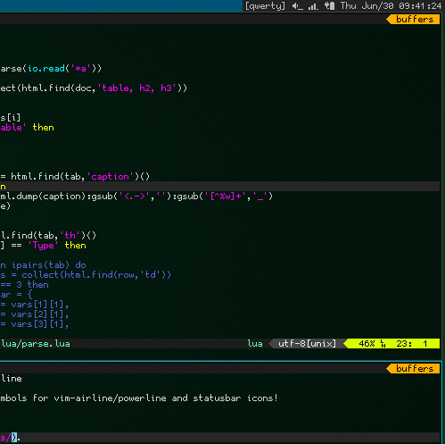

# gohufont-powerline (gohup)

GohuFont with symbols for vim-airline/powerline and statusbar icons!

It looks like this:

  

---

GohuFont is under WTFPL, Hugo Chargois (2010), converted to TTF by Guilherme Komaeda (2015), Powerline symbols added by Daniel Lima (2015).
