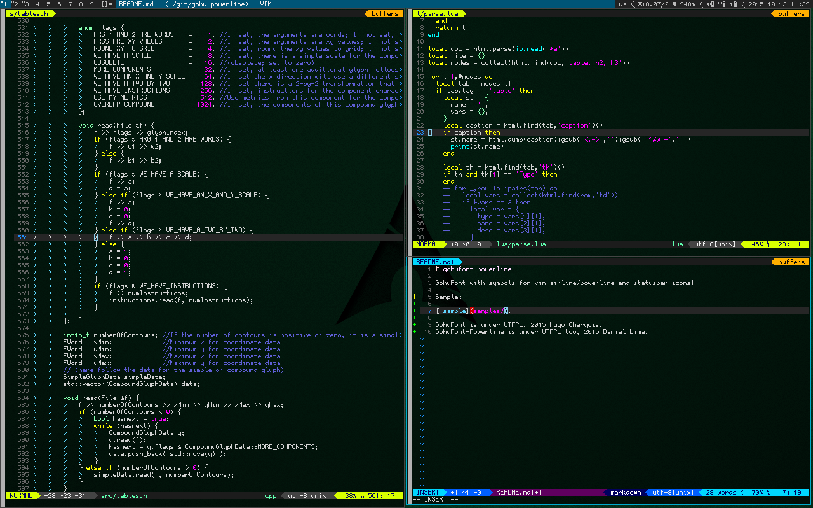

# gohufont-powerline (gohup)

GohuFont with symbols for vim-airline/powerline and statusbar icons!

It looks like this:

  

---

GohuFont is under WTFPL, 2015 Hugo Chargois.
GohuFont-Powerline is under WTFPL too, 2015 Daniel Lima.
